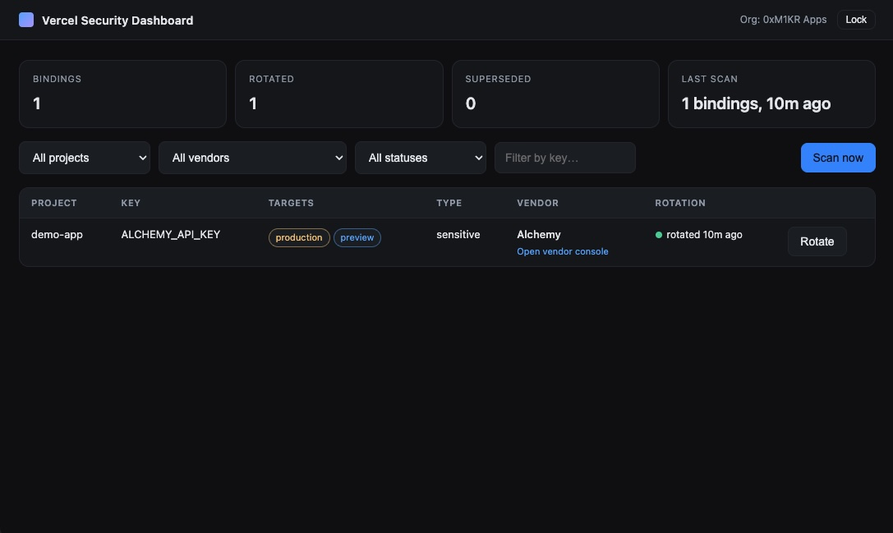

# Vercel Security Dashboard

Local-first, open-source dashboard that:

1. **Scans** every project in a chosen Vercel team and inventories its
   environment variable **metadata** (key name, targets, secret/plain type).
2. **Attributes** each variable to a likely third-party service (AWS, Neon,
   Stripe, …) using a configurable rule set.
3. **Tracks** rotation state — which variables you have rotated since the
   last scan, with timestamps and an audit log.
4. **Rotates** values via the **Vercel REST API** with a guarded modal,
   without ever persisting environment variable **values** on disk.

Read the full plan in [`docs/PLAN.md`](docs/PLAN.md).

## Screenshots & demo



[`Overview & Demo`](https://x.com/0xm1kr/status/2046040869732757824)

## Constraints

- **No Vercel npm packages** and no Vercel CLI: only `https://api.vercel.com`
  via the global `fetch`.
- **No Vercel-branded UI packages**: the UI is plain HTML / CSS / vanilla JS.
- **Minimal runtime dependencies** — see
  [`docs/DEPENDENCIES.md`](docs/DEPENDENCIES.md).

## Requirements

- Node.js **>= 20** (uses global `fetch` and the built-in test runner).
- A Vercel API token. The app's onboarding wizard will walk you through
  creating one.

## Install & run

```bash
npm install
npm run build
npm start
```

The server binds to `http://127.0.0.1:4319` by default. Open that URL in
your browser. On first run you will be sent through the **Onboarding
Wizard**:

1. Choose a passphrase (used to encrypt the API token at rest).
2. Open Vercel and create a token (the wizard provides the link).
3. Paste the token; the app verifies it by calling Vercel.
4. Pick the team / organization to scan.
5. Optionally mint a narrower, dashboard-specific token.

## Where data lives

By default, the app stores data under `./data/` (gitignored):

- `inventory.sqlite` — metadata, scans, rotation audit. **No secret values.**
- `credentials.bin` + `credentials.salt` — encrypted Vercel token blob.

You can override the directory with `VSD_DATA_DIR=/some/path npm start`.

## Configuration

- Default vendor rules: [`config/vendor-rules.default.json`](config/vendor-rules.default.json)
- Optional override: place a `vendor-rules.override.json` next to it (or in
  the data directory) to add or replace rules.
- Suggestions for unmatched keys are written to
  `data/vendor-rules.suggested.json` after each scan.

## Security

See [`SECURITY.md`](SECURITY.md) for the threat model and how to report
issues. In short: the SQLite file contains **variable names and metadata**
and should be treated as sensitive. The API token is encrypted at rest.
Environment variable **values** are never persisted.

## Architecture

Domain-Driven Design with hexagonal layering:

```
src/
  domain/          # entities, value objects, domain errors (no IO)
  application/     # use cases + port interfaces
  infrastructure/  # Vercel REST client, SQLite repos, crypto
  interface/       # local HTTP server + static UI assets
```

See [`docs/PLAN.md`](docs/PLAN.md) §6 for the full breakdown.

## Tests

```bash
npm test
```

Uses the built-in `node --test` runner; no separate test framework.

## License

MIT — see [`LICENSE`](LICENSE).
